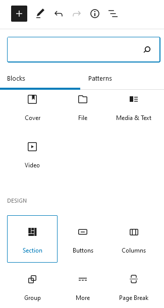
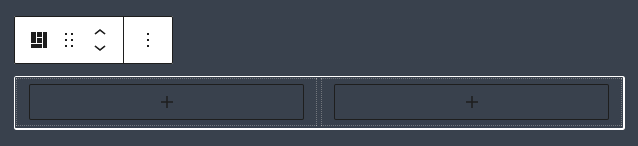
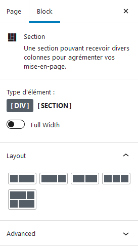
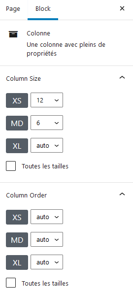

# Gutenberg-Columns-Block
Un super bloc Gutenberg pour wordpress permettant d'utiliser les Colonnes de Bootstrap !
Environnement de développement largement inspiré de https://github.com/WordPress/gutenberg-examples

Ce repo est destiné à développer un block Gutenberg pour Wordpress qui gère l'intégration du frameworks CSS
`Bootstrap` afin de pouvoir y ajouter facilement des sections et colonnes. 

Le code des différents fichiers est largement commenté afin de vous aider à comprendre le fonctionnement
de `REACT` et `Gutenberg`, ainsi que les paramètres utilisés pour `Webpack` afin de générer les fichiers
nécessaires au plugin.

## Installation

------------
Pour développer et tester le plugin en local, un fichier Docker-Compose est présent afin de monter un
serveur Apache/PHP et MariaDB contenant directement Wordpress et le plugin. Une commande make a été créée
afin de faciliter le déploiement :

Pour installer la commande "make" sur Windows :
http://gnuwin32.sourceforge.net/packages/make.htm

> _make up_

Pour démonter les containers Docker :
> _make stop-all_

Pour accéder au terminal du container Apache/PHP :
> _make shell_

Si vous souhaitez juste installer le plugin directement dans votre répertoire Wordpress, vous pouvez
télécharger la dernière version et ajouter le contenu du fichier .Zip dans le dossier `./wp-content/plugins`

## Utilisation

------------
Une fois le plugin installé et activé, vous trouverez un nouveau block Gutenberg dans l'éditeur de pages/posts.

Le block Gutenberg est constitué d'un bloc "parent" content des "innerBlock" enfants faisant office de colonnes :

Le block parent "section" contient différentes options de mise en page et d'attributs :

Les blocks enfants "Colonne" possèdent des propriétés de tailles "responsive" à la manière de Bootstrap :

### devDependencies

**bootstrap 4.x**
>pour utiliser bootstrap

**dart-sass**
>pour compiler le SASS / SCSS en un seul fichier CSS. C'est aussi ce qui permet de retirer
>le strict minimum de `Boostrap`

**docker-compose.yml**
>contient les réglages "basiques" d'un container Wordpress et MySQL (MariaDB)
>ainsi qu'un lien du dossier `./build` avec le dossier `plugins/ized-gutenberg` de wordpress
>pour un déploiement rapide du script Gutenberg.
>
>Le container wordpress est construit à partir de l'image `wordpress:latest` en y ajoutant
>la library et configuration xDebug pour php.
> 
>Préparé pour xDebug 3. `PHP_XDEBUG_REMOTE_HOST: host.docker.internal` du fichier
>`docker-compose.yml` contient l'URL de connection pour lier xDebug à l'IDE.
>
>http://localhost

**package.json**
>Pour voir l'ensemble des dépendances, voir le fichier `package.json` et pour les
>installer `npm install`

**webpack.config.js**
> En attendant une meilleure version du Read-Me `webpack.md`, lire les commentaires
> du fichier `webpack.config.js` et du fichier `./scripts/sass/ized-sass.js`
> qui sert de "loader" SASS pour _webpack_